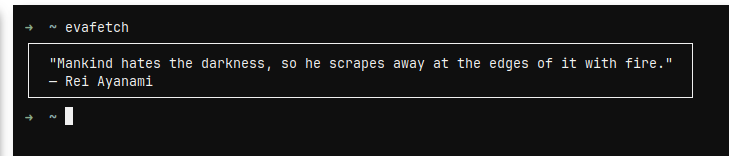
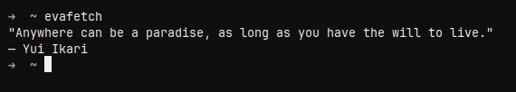

# evafetch
small rust program that displays neon genesis evangelion quotes in terminal.
supports customizable borders and padding

---

## features

- displays random quotes
- customizable border and padding
- works on linux and mac, maybe windows

---

## installation

clone the repository and use cargo to install

```bash
git clone https://github.com/sleepybaby898/evafetch.git
cd evafetch
cargo install --path . 
```

after installation, the program can be run with

```bash
evafetch
```

---

## configuration

the config file is located at

```arduino
~/.config/evafetch/config.toml
```
example `config.toml`:

```toml
[config]
border = true # show a border around quotes
padding = 2 # number of spaces around the quote
```
a config file will be automatically generated

---

## example

running the command with a border:



without a border:




